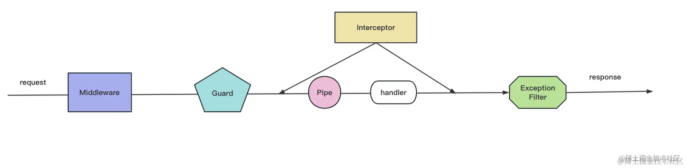

```js
nest实现AOP的方式一共有5种（面向切面编程）

```
- Middleware                   NestModule
- Guard                        CanActivate
- Pipe                         PipeTransform
- Interceptor                  NestInterceptor
- ExceptionFilter              ExceptionFilter(异常处理)  

##### AOP的顺序关系

调用顺序：

