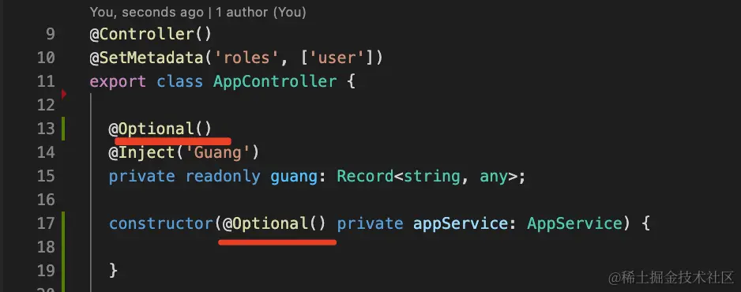

##### <center> NestJs装饰器</center>
- @Module 声明模块
```js
@Module({
    imports:[],
    controllers:[AppController],
    providers:{AppService}
})
export class AppModule{}

```
- @Controller 声明controller
```js
@Controller()
export class AppController{
    constructor(private readonly  appService: AppService){}
}

```
- @Injectable 声明provider
```js
@Injectable()
export class AppService{
    getHello():string{
        retrun 'Hello World'
    }
}

```
- @Optional声明
   -- 如果注入依赖没有的话，创建对象时会报错，但如果它是可选，可以用@Optional声明，
   这样没有对应的provider也能正常创建这个对象



- @Global全局声明